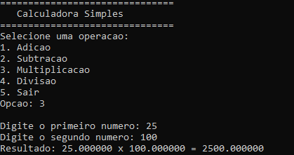

# Calculadora-Baseada-em-Texto-em-C
Este projeto consiste em uma calculadora simples desenvolvida em C, que permite ao usuário realizar operações matemáticas básicas de forma interativa. O programa apresenta um menu de opções, permitindo que o usuário escolha a operação desejada, insira as opções e obtenha o resultado.

<p align = "left">

</p>

## Demonstração



Interface do Jogo da Velha em execução no terminal.

## Instalação e Pré-requisitos

### Pré-requisitos

- Compilador C++ compatível com C++11 ou superior;
- Terminal ou prompt de comando para executar o programa;
- Sistema Windows para limpar a tela automaticamente com system("cls");
-  Para Linux/macOS, o comando system("cls") deve ser alterado para system("clear").

### Passos para Instalar

1. Baixe ou clone o projeto;
2. Compile o código.

## Usos e Exemplos

Após baixar ou clonar o projeto, siga os passos abaixo para compilar e executar o jogo no terminal.

### Compilar o Código

No Windows, abra o terminal e digite:

```
g++ src/Jogo-da-Velha.cpp -o JogoDaVelha.exe
```

No Linux/macOS:

```
g++ src/Jogo-da-Velha.cpp -o JogoDaVelha
```

### Executando o Jogo:

No Windows:

```
JogoDaVelha.exe
```

No Linux/macOS:

```
./JogoDaVelha
```

## Como Jogar

1. O Jogador 1 (X) escolhe uma posição de 1 a 9 no tabuleiro;
2. O Jogador 2 (O) faz sua jogada em seguida;
3. O tabuleiro é atualizado a cada jogada;
4. O jogo termina quando um jogador vence ou ocorre empate.

## Estrutura do Projeto

```
Jogo-da-Velha-em-CPP/
├── assets/
│   └── Jogo-da-Velha.png
├── src/
│   └── Jogo-da-Velha.cpp
├── LICENSE
└── README.md
```
## Licença 

Este projeto está licenciado sob a MIT License - veja o arquivo [LICENSE](LICENSE) para mais detalhes. 
